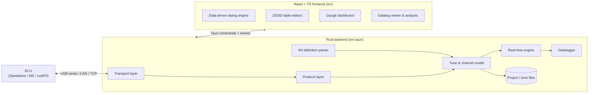

# OpenTune

> **OpenTune** A modern, open-source, cross-platform tuning
> application for engine management ECUs. The goal is to be a first-class
> replacement for TunerStudio, with native support for Apple Silicon macOS,
> Windows, and Linux.

---

## Download

OpenTune release builds are available on the
[Releases page](https://github.com/d0pawlus/OpenTune/releases) — grab the
installer for your OS (macOS `.dmg` for Apple Silicon or Intel, Windows
`setup.exe`/`.msi`, Linux `.AppImage`/`.deb`/`.rpm`). A rolling `nightly`
pre-release built from the latest commits is also published there. Prefer to
build it yourself instead? See [CONTRIBUTING.md](CONTRIBUTING.md) —
`npm run tauri build`.

macOS and Windows builds do not yet have publisher signatures, so expect OS
warnings:

- **macOS** — the app is not notarized yet. Open it once (macOS will block
  it), then go to _System Settings → Privacy & Security_ and click
  _Open Anyway_ — the old right-click → _Open_ bypass no longer works on
  macOS 15 (Sequoia) and later. Alternatively, clear the quarantine flag:
  `xattr -cr /Applications/OpenTune.app`.
- **Windows** — SmartScreen will warn about an unknown publisher.
  _More info_ → _Run anyway_.
- **Linux** — download the `.AppImage`, then `chmod +x OpenTune_*.AppImage`
  and run it. `.deb` (Debian/Ubuntu) and `.rpm` (Fedora/openSUSE) packages
  are also provided. Serial-port access may require adding your user to the
  `dialout` group (`sudo usermod -aG dialout $USER`, then re-login).

Apple notarization and Windows publisher signing are deferred until the project
owner obtains the required Apple Developer account and Windows certificate.
Updater archives use a separate Tauri signature and are verified before
installation. See [install and update guidance](docs/updates.md).

## Why this project exists

[TunerStudio](https://www.tunerstudio.com/) is the de-facto standard tuning
application for a large family of open and semi-open ECUs (Speeduino, MegaSquirt,
rusEFI, and many others). It is, however:

- **Aging and effectively closed.** It is a Java/Swing application whose future
  on modern macOS (Apple Silicon, tightened notarization/Gatekeeper rules) is
  uncertain, and it is not open source.
- **Not optimized for modern hardware.** Real-time gauges, large datalogs, and
  3D table rendering are heavier than they need to be.
- **Hard to extend by the community.** There is no open contribution model.

**OpenTune** aims to fix all three: a fast, modern, genuinely open-source tool
that the community can own and evolve.

## Vision & principles

1. **Universal by design.** Almost everything ECU-specific is _data-driven_ from
   the firmware's `.ini` definition file (the same format TunerStudio uses). The
   application core is generic — supporting a new ECU means supporting its INI,
   not writing new code. This is how we target Speeduino, MegaSquirt, rusEFI and
   "many others" _at once_.
2. **Fast and lean.** Tauri (Rust backend + web frontend) gives us native
   performance, tiny binaries, and a serial/real-time data path written in Rust.
3. **Easy to develop.** A documented, modular architecture, a built-in **ECU
   simulator** so contributors can work without physical hardware, and a
   mainstream frontend stack (React + TypeScript).
4. **Truly open source.** Open license, open roadmap, open contribution model.
5. **Interoperable.** Read and write the file formats people already have:
   `.msq` tunes, `.mlg`/CSV datalogs, and standard `.ini` definitions.
6. **AI-assisted, deterministically.** The differentiator: an optional AI assistant
   that analyzes live data and logs and helps tune — built on a **deterministic,
   auditable core** (the AI orchestrates and explains; the numbers come from
   reproducible tooling). Off by default, opt-in (BYOK), designed toward future
   autonomous tuning. See
   [the AI design](docs/superpowers/specs/2026-06-21-ai-tuning-and-analysis-design.md)
   and [ADR-0008](docs/adr/0008-ai-integration.md).

## Target platforms

| Platform                     | M6 release status                  |
| ---------------------------- | ---------------------------------- |
| macOS (Apple Silicon, arm64) | Installer + signed updater archive |
| macOS (Intel, x64)           | Installer + signed updater archive |
| Windows 10/11 (x64)          | Installer + signed updater archive |
| Linux (x64)                  | AppImage, deb, rpm + updater        |
| Linux (arm64)                | Planned                            |

## Supported ECUs (goal)

Because support is driven by the firmware INI, the goal is to work with any ECU
that ships a TunerStudio-compatible `.ini` definition, including:

- **Speeduino**
- **rusEFI**
- **MegaSquirt** (MS1/MS2/MS3 family)
- and other MS-protocol-compatible controllers.

See [`docs/protocol.md`](docs/protocol.md) and
[`docs/ini-format.md`](docs/ini-format.md) for how this works.

## Project status

🚧 **Pre-1.0 — active implementation.** Milestones M0–M6 are implemented:
the Tauri application can parse firmware INIs, identify the simulator or a
serial ECU, and run the end-to-end flow on the hardware-free simulator —
read/edit/burn, realtime dashboard, table/curve/3D editors, deterministic
auto-tune, and datalog capture with analysis. The M6 release adds
interop evidence, signed in-app updates, onboarding, Polish/English preferences,
an accessibility baseline, cross-platform packaging, and public documentation.
Publisher signing for macOS/Windows is explicitly deferred; see
[ROADMAP — M6](docs/ROADMAP.md#m6--interop-polish--first-release-).

The project is not ready for production tuning yet. Real-hardware coverage,
publisher signing, and broader firmware compatibility remain pre-1.0 work; see
the roadmap and [M6 compatibility evidence](docs/compatibility/m6.md).

Start here:

- [`docs/ARCHITECTURE.md`](docs/ARCHITECTURE.md) — the system architecture.
- [`docs/ROADMAP.md`](docs/ROADMAP.md) — milestones and what we build, in order.
- [`docs/research/market-and-user-research.md`](docs/research/market-and-user-research.md)
  — what TunerStudio users actually need, the competitive landscape, and the
  formats/protocol terrain (with sources).
- [`docs/adr/`](docs/adr/) — Architecture Decision Records (the _why_ behind key
  choices).
- [`docs/ini-format.md`](docs/ini-format.md) — the firmware definition format.
- [`docs/protocol.md`](docs/protocol.md) — the ECU communication protocol.
- [`docs/glossary.md`](docs/glossary.md) — domain terms for newcomers.
- [`CONTRIBUTING.md`](CONTRIBUTING.md) — how to get involved.

## Planned high-level architecture

## License

**GPL-3.0-or-later** — see [`LICENSE`](LICENSE) and
[`docs/adr/0005-license.md`](docs/adr/0005-license.md). This matches the ethos of
the open ECU ecosystem (Speeduino and rusEFI firmware are GPL) and protects the
work from a closed-source fork. Source files will carry
`SPDX-License-Identifier: GPL-3.0-or-later` headers in source files.

## Acknowledgements

This project stands on the shoulders of the open ECU community — Speeduino,
rusEFI, MegaSquirt/MShift, MegaTunix, and the documented TunerStudio INI format.
We aim to be a good citizen of that ecosystem and remain interoperable with it.
