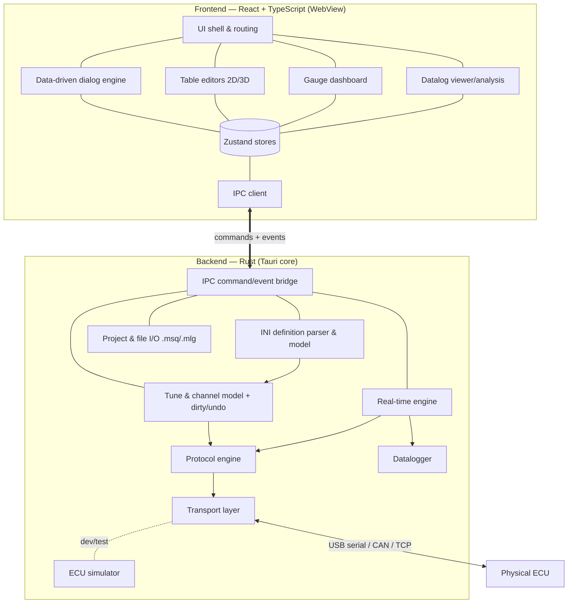
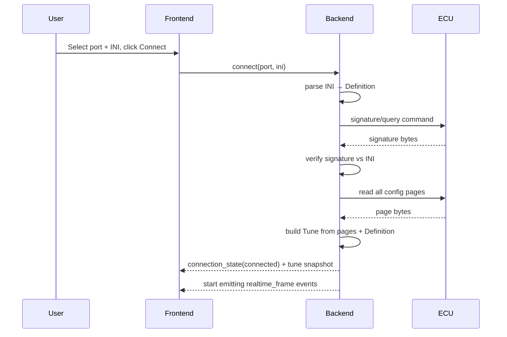
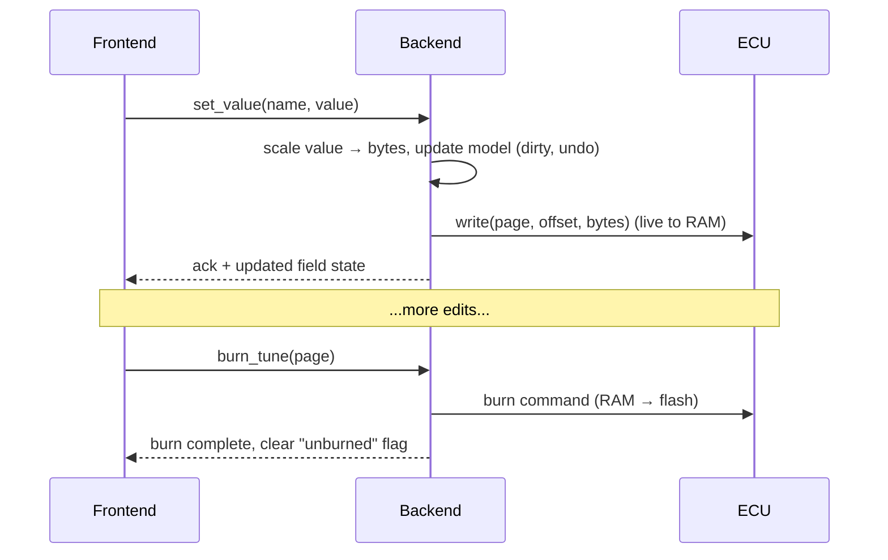

# Architecture

This document describes the architecture of OpenTune — a cross-platform,
open-source tuning application for engine management ECUs, intended as a modern
replacement for TunerStudio.

It is the canonical reference for _how the system is built and why_. Decisions
with long-lived consequences are captured as ADRs in [`adr/`](adr/); this
document focuses on the overall structure and the interaction between components.

- [1. Goals and non-goals](#1-goals-and-non-goals)
- [2. The core idea: a data-driven, universal core](#2-the-core-idea-a-data-driven-universal-core)
- [3. Technology stack](#3-technology-stack)
- [4. High-level architecture](#4-high-level-architecture)
- [5. Backend (Rust) modules](#5-backend-rust-modules)
- [6. Frontend (React + TS) modules](#6-frontend-react--ts-modules)
- [7. The IPC contract](#7-the-ipc-contract)
- [8. Key data flows](#8-key-data-flows)
- [9. Concurrency & performance model](#9-concurrency--performance-model)
- [10. The ECU simulator](#10-the-ecu-simulator)
- [11. File formats & interoperability](#11-file-formats--interoperability)
- [12. Cross-cutting concerns](#12-cross-cutting-concerns)
- [13. Testing strategy](#13-testing-strategy)
- [14. Proposed repository layout](#14-proposed-repository-layout)
- [15. Risks and open questions](#15-risks-and-open-questions)

---

## 1. Goals and non-goals

### Goals

- **Universal ECU support** driven by firmware `.ini` definition files, so adding
  an ECU rarely requires new code.
- **Native performance** for real-time gauges (tens of Hz), large 3D tables, and
  multi-megabyte datalogs.
- **First-class macOS (Apple Silicon)** support, plus Windows and Linux.
- **Interoperability** with the existing ecosystem: `.ini`, `.msq`, `.mlg`/CSV.
- **Low barrier to contribution**: documented modules, mainstream frontend, and a
  hardware-free development path (the simulator).

### Non-goals (for now)

- Not aiming to be byte-for-byte bug-compatible with every TunerStudio quirk.
- Not (initially) a mobile app, though the architecture should not preclude it. A
  mobile (Android/iOS) companion is a planned ecosystem direction — live view
  first, tune editing later; the decoupled core crates (§5) are what keep that
  open. See [ROADMAP.md](ROADMAP.md) "Beyond 1.0".
- Not a firmware development tool; we _tune and configure_ ECUs, we don't build
  their firmware.
- No proprietary/encrypted INI handling (some commercial firmwares ship locked
  definitions); we focus on open and openly-documented definitions.

## 2. The core idea: a data-driven, universal core

TunerStudio's real power is that it is mostly a **generic engine** parameterized
by a firmware-supplied **INI definition file**. The INI describes:

- The **memory layout** of the ECU's configuration ("pages" of "constants").
- The **real-time output channels** the ECU streams back.
- The **UI**: menus, dialogs, fields, tables, curves, and gauges.
- The **communication parameters**: which serial commands to use, timeouts,
  CRC/endianness, page-switching behavior, etc.

OpenTune adopts the same philosophy:

> **The application core knows nothing about any specific ECU.** It loads an INI,
> builds an in-memory model of that ECU's memory, channels, and UI, and then
> drives everything generically.

This is the single most important architectural decision (see
[ADR-0002](adr/0002-data-driven-ini.md)). It means:

- Speeduino, MegaSquirt, and rusEFI are supported _by the same code_, differing
  only in their INI.
- New firmware versions are supported by dropping in a new INI.
- ECU-specific behavior that _can't_ be expressed in INI is isolated behind small,
  well-defined extension points (see §5.2 and §15).

## 3. Technology stack

| Layer                   | Choice                                  | Rationale (see ADRs)                                                                                          |
| ----------------------- | --------------------------------------- | ------------------------------------------------------------------------------------------------------------- |
| App shell               | **Tauri v2**                            | Native, tiny binaries, secure IPC, excellent macOS/Apple-Silicon support. [ADR-0001](adr/0001-tauri-stack.md) |
| Backend language        | **Rust**                                | Memory-safe systems language; great serial + concurrency story; fast INI/realtime parsing.                    |
| Serial I/O              | **`serialport`** (serialport-rs)        | Mature cross-platform serial crate.                                                                           |
| Frontend                | **React + TypeScript + Vite**           | Mainstream, huge contributor pool, fast HMR. [ADR-0003](adr/0003-frontend-stack.md)                           |
| State                   | **Zustand**                             | Minimal, fast, ergonomic global state.                                                                        |
| Time-series charts      | **uPlot**                               | Extremely fast canvas charting for large datalogs.                                                            |
| 3D tables               | **three.js** (via a thin React wrapper) | GPU-accelerated 3D surfaces for VE/ignition tables.                                                           |
| 2D table grids / gauges | **HTML Canvas** (custom)                | Direct canvas rendering for high-frequency redraws.                                                           |
| Packaging/CI            | **GitHub Actions**                      | Cross-platform build + sign + release.                                                                        |

See ADRs for the full reasoning and alternatives considered.

## 4. High-level architecture

OpenTune is a single desktop application split into a **Rust backend** (the Tauri
"core", `src-tauri/`) and a **web frontend** (`src/`). They communicate only
through Tauri's IPC: request/response **commands** and push **events**.



**Layering rule:** dependencies point _downward and inward_. The frontend depends
on the IPC contract, not on backend internals. Within the backend, the transport
layer knows nothing about INI; the protocol layer depends on the model and
transport; the real-time engine orchestrates protocol + logger. This keeps each
layer independently testable.

## 5. Backend (Rust) modules

The backend is organized as a Cargo workspace of focused crates so that the
domain logic (parser, protocol, model) is **decoupled from Tauri** and can be
unit-tested and reused (e.g., by a future CLI or headless logger).

```
src-tauri/
├── crates/
│   ├── ini/          # INI definition parsing + expression evaluation
│   ├── model/        # Tune pages, constants, channels, scaling, undo/redo
│   ├── protocol/     # Protocol engine (commands, CRC, paging, endianness)
│   ├── transport/    # Serial/TCP transports behind a trait
│   ├── realtime/     # Polling loop, channel decoding, broadcasting
│   ├── datalog/      # MLG/CSV readers & writers
│   ├── analysis/     # Deterministic tuning/analysis: ve_analyze, virtual_dyno, …
│   ├── ai/           # (M7) AI tool registry, permission policy, guardrails, audit records
│   ├── project/      # .msq read/write, project save/load, settings
│   └── simulator/    # Virtual ECU for dev/testing
└── src/              # Tauri app: wires crates together, defines commands/events
```

### 5.1 `transport` — talking to hardware

- A `Transport` trait: `open`, `close`, `read`, `write`, `flush`, configurable
  timeouts. Async (Tokio) with a blocking-serial bridge where needed.
- Implementations: `SerialTransport` (USB/UART via `serialport`) and `SimTransport`
  (in-process simulator). A `TcpTransport` (network/Wi-Fi bridges) is planned but
  intentionally not yet built — out of scope until a real TCP-bridge use case lands
  (YAGNI).
- Port discovery & hot-plug detection (enumerate ports, identify likely ECUs by
  USB VID/PID where known).
- **Knows nothing about protocol semantics** — it moves bytes.

### 5.2 `protocol` — the conversation with the ECU

The protocol is itself _largely data-driven_ from the INI (`queryCommand`,
`signature`, `ochGetCommand`, `pageReadCommand`, `pageValueWrite`, `burnCommand`,
CRC commands, timeouts, etc. — see [`protocol.md`](protocol.md)).

- A `Protocol` trait with operations: `signature()`, `version()`,
  `read_page(page)`, `write(page, offset, bytes)`, `burn(page)`,
  `read_realtime()`, `command(action)`.
- A default **generic MS/TS-compatible** implementation parameterized by the INI
  communication settings — this covers Speeduino, rusEFI, and MegaSquirt families.
- **Extension points** for the rare ECU-specific quirk that INI can't express,
  selected by signature. These are the _only_ place ECU-specific code should live.
- Handles framing, CRC32 (newer "CRC protocol"), retries/backoff, page activation
  delays, and big/little-endian fields.

### 5.3 `ini` — firmware definitions

- Tokenizer + parser for the TunerStudio INI dialect (sections, `#if/#else`
  preprocessing, `[ConstantsExtensions]`, includes).
- A small, sandboxed **expression evaluator** for INI expressions used in
  scaling, conditional `visible`/`enable` clauses, and computed fields.
- Produces an immutable `Definition` model: pages, constants (scalar/array/bit
  fields with type, scale, translate, units, limits, digits), output channels,
  menus, dialogs/panels/fields, table & curve editors, gauge configs.
- Detailed in [`ini-format.md`](ini-format.md).

### 5.4 `model` — the live tune & channels

- `Tune`: the in-memory image of all configuration pages (raw bytes) plus typed
  accessors derived from the `Definition` (read/write a constant by name with
  scaling applied).
- Dirty tracking per field/page; **undo/redo** via a command stack.
- **RAM vs. flash** semantics: edits apply to the ECU's RAM immediately for live
  tuning; an explicit **burn** persists to flash. The model tracks "modified but
  not burned" state.
- `Channels`: typed, scaled view over a real-time output-channel frame.

### 5.5 `realtime` — the live data engine

- A polling task that, at a configurable rate, asks the `protocol` for an output
  channel frame, decodes it via the `Definition`, and publishes:
  - **batched/throttled** updates to the frontend (events), and
  - **full-rate** samples to the `datalog` writer.
- Backpressure-aware: decouples acquisition rate from UI refresh rate so a slow
  WebView never stalls acquisition or logging.

### 5.6 `datalog` — recording & reading logs

- Writers for **MLG** (TunerStudio's binary log format) and **CSV**.
- Readers for the same, to power the in-app log viewer/analysis.
- Log record schema is derived from the INI `[Datalog]`/output-channel section.

### 5.7 `project` — files & persistence

- `.msq` (TunerStudio tune, XML) import/export for interoperability.
- Native project format bundling: the INI in use, the current tune, dashboard
  layouts, and user settings.
- App settings (recent projects, serial preferences, UI prefs).

### 5.8 `simulator` — virtual ECU

A first-class `Transport`/`Protocol` implementation that emulates an ECU from a
real INI (signature, pages, realtime channels with plausible, animated values),
so contributors and CI can run the whole app without hardware. See §10.

### 5.9 `analysis` — the deterministic tuning core

Pure, side-effect-free, **deterministic** capabilities with explicit
`(data + params) → result + justification` contracts: `ve_analyze`,
`virtual_dyno`, `log_stats`, `detect_anomaly`. Same input → identical output; every
result carries _why_ (which log samples drove it, how many, what was filtered).
Independent of AI and UI. **One engine, many consumers:** the manual AutoTune
button, the AI layer, and future autonomy all call the same functions — there is
exactly one implementation of each tuning operation.

### 5.10 `ai` — the AI orchestration layer (built on `analysis`)

The differentiator, designed to never touch the ECU or logs except through the
deterministic tools in `analysis`. Three parts: a **tool registry** (each
`analysis` capability exposed with a JSON schema; read-only vs. mutating tools), a
**permission policy** (`advisory` default → `assisted` → `autonomous`; authority is
configuration, not hardcoded), and a **provider abstraction** (enum-dispatched
`Provider`; BYOK cloud, off by default, opt-in — preserving offline-first/privacy-
by-default; local models addable later). **Guardrails live in the tool layer, not
the prompt** — mutating tools validate against INI limits, rate-limit, require a
healthy connection, and audit every action, so the LLM has no path to bypass them.
As of M7 slice 2, the provider layer is complete: `ai_provider.rs` (provider
abstraction via enum dispatch with Anthropic and OpenAI streaming implementations),
`ai_settings.rs` (keyring-backed API key storage and persisted opt-in settings),
and `ai_commands.rs` (IPC bridge to the frontend). The embedded assistant panel
(§6.5) and MCP server remain for M7 slices 3 and 4. Full design:
[AI tuning & analysis design](superpowers/specs/2026-06-21-ai-tuning-and-analysis-design.md).

## 6. Frontend (React + TS) modules

```
src/
├── app/            # App shell, routing, layout, theming, i18n
├── ipc/            # Typed client for Tauri commands & events
├── stores/         # Zustand stores (connection, tune, realtime, project)
├── definition/     # Frontend model of the parsed INI (mirrors backend types)
├── dialogs/        # Data-driven dialog/settings rendering engine
├── tables/         # 2D heatmap + 3D surface table editors
├── gauges/         # Gauge widgets + dashboard layout editor (canvas)
├── datalog/        # Log viewer, charts (uPlot), analysis tools
├── assistant/      # Embedded AI assistant panel (consumes the `ai` layer)
├── components/     # Shared UI primitives
└── lib/            # Utilities (formatting, math, color maps)
```

### 6.1 Data-driven dialog engine

The heart of the UI: given the parsed INI's menus/dialogs, it **renders the
settings UI automatically** — panels, fields (numeric, enum, bit, string), with
conditional `visible`/`enable` evaluated from current tune values. No per-ECU
React code. Editing a field dispatches a typed command through the IPC layer.

### 6.2 Table editors

- **2D**: a high-performance heatmap grid with interpolation, smoothing, scaling,
  copy/paste, and keyboard nudging — rendered on canvas for responsiveness on
  large tables.
- **3D**: a GPU-rendered surface (three.js) for VE/ignition/AFR tables, with the
  operating point overlaid live during tuning.

### 6.3 Gauge dashboard

Configurable dashboards of gauges (round, bar, digital, indicators) bound to
real-time channels, rendered on canvas and updated from throttled realtime
events. Layouts are user-editable and saved with the project.

### 6.4 Datalog viewer & analysis

Time-series and scatter views over recorded logs (uPlot for speed), playback
synced with the dashboard, and analysis tools (e.g., VE/auto-tune table
suggestions from logged data).

### 6.5 Embedded AI assistant

A chat/assistant panel that drives the backend `ai` layer (§5.10): the user asks
for analysis or suggestions; the model calls deterministic tools and explains the
result. At the default `advisory` level it can propose changes but not write them —
the user applies. Designed for live in-car tuning; the same backend tool registry
also backs the MCP server for external agents. Off by default (opt-in, BYOK).

## 7. The IPC contract

The boundary between frontend and backend is a **typed, versioned contract**. To
avoid drift, Rust types are the source of truth and TypeScript types are
**generated** from them via `tauri-specta` (see `src/ipc/bindings.ts`, which is
auto-generated — never hand-edit).

Two interaction styles:

- **Commands** (request/response), representative of the ~40 registered:
  `connect`, `disconnect`, `list_ports`, `get_definition`, `load_tune`,
  `get_values`, `set_value`/`set_cells`, `burn_tune`, `undo_tune`/`redo_tune`,
  `new_tune`/`open_tune`/`save_tune`/`write_tune_to_ecu`,
  `start_realtime`/`stop_realtime`, `run_ve_analyze`, `start_capture`/
  `stop_capture`, `start_log`/`stop_log`, `log_stats`/`detect_anomaly`/
  `virtual_dyno`, …
- **Events** (backend → frontend push), the four registered in
  `collect_events!`: `heartbeat` (1 Hz liveness signal),
  `connection-state-event` (link/identify status), `tune-dirty-event`
  (unburned-edits flag), and `realtime-frame-event` (throttled realtime data).

Design rules:

- The frontend treats the backend as the **single source of truth** for tune and
  connection state; it does not duplicate authority over hardware.
- High-frequency data (realtime) flows via **events**, never request/response.
- Every command is cancellable/idempotent where it touches hardware.

## 8. Key data flows

**Connect & identify ECU**



**Live edit & burn**



## 9. Concurrency & performance model

- The backend uses an **async runtime (Tokio)**. A single owner task holds the
  transport; all hardware access is serialized through a command channel to avoid
  interleaved serial traffic (serial is inherently single-conversation).
- The **realtime acquisition loop** runs independently of the UI. Acquisition and
  logging happen at full device rate; UI events are **coalesced/throttled** (e.g.,
  ~30 Hz) so the WebView is never the bottleneck.
- Heavy CPU work (INI parsing, log analysis) runs off the UI/IPC thread.
- Frontend rendering uses **canvas/WebGL** for anything that updates frequently
  (gauges, tables, charts), keeping React reconciliation off the hot path.

## 10. The ECU simulator

A virtual ECU is a deliberate, first-class feature — not an afterthought — because
it makes the project **easy to develop and to test** (a stated goal).

- Loads any real INI and presents itself as a connectable "device".
- Responds to signature/version, serves page reads/writes (with a backing memory
  image), and **synthesizes plausible, animated realtime channels** (RPM sweep,
  correlated MAP/TPS, temperatures warming up, AFR, etc.).
- Selectable via the normal connect flow (a "Simulator" port) and usable in CI
  for end-to-end tests without hardware.

## 11. File formats & interoperability

| Format                 | Direction  | Purpose                                      |
| ---------------------- | ---------- | -------------------------------------------- |
| `.ini` (TS definition) | read       | Firmware definition (memory, UI, comms).     |
| `.msq` (XML)           | read/write | Tune files — interoperable with TunerStudio. |
| `.mlg` (binary)        | read/write | TunerStudio-compatible datalogs.             |
| `.csv`                 | read/write | Portable datalogs / spreadsheet analysis.    |
| OpenTune project       | read/write | Bundle: INI + tune + dashboards + settings.  |

Interoperability is a hard requirement: users must be able to bring their
existing INIs, tunes, and logs, and take them elsewhere.

## 12. Cross-cutting concerns

- **Error handling:** typed errors across the IPC boundary; user-facing messages
  separated from diagnostics. Hardware errors must never crash the app.
- **Logging/telemetry:** structured logs (`tracing` in Rust); **no** network
  telemetry by default (privacy by default).
- **i18n:** UI strings externalized from day one; Polish and English first. Note
  that INI-supplied labels are firmware-language (usually English) and are passed
  through.
- **Configuration & secrets:** none required; the app is offline-first.
- **Accessibility:** keyboard-first table/dialog editing; high-contrast theming.
- **Updates:** Tauri updater for signed releases (opt-in).

## 13. Testing strategy

- **Rust unit tests** for the parser (golden-file tests against real Speeduino /
  rusEFI / MS INIs), expression evaluator, scaling math, CRC, and `.msq`/`.mlg`
  round-trips.
- **Protocol tests** against the **simulator** (no hardware needed).
- **Frontend unit/component tests** (Vitest + Testing Library) for the dialog
  engine and table math.
- **End-to-end tests** driving the real app against the simulator in CI.
- **Hardware-in-the-loop**: a manual/optional CI lane and a community testing
  guide for verification against real Speeduino/MS/rusEFI boards.

## 14. Proposed repository layout

```
/
├── README.md
├── LICENSE                      # (to be added — see ADR-0005)
├── CONTRIBUTING.md
├── docs/
│   ├── ARCHITECTURE.md          # this file
│   ├── ROADMAP.md
│   ├── ini-format.md
│   ├── protocol.md
│   ├── glossary.md
│   └── adr/                     # Architecture Decision Records
├── src/                         # frontend (React + TS)
├── src-tauri/                   # backend (Rust workspace + Tauri)
│   ├── crates/                  # ini, model, protocol, transport, …
│   └── src/                     # Tauri commands/events wiring
└── .github/workflows/           # CI: build/test/release
```

(Through M5 the full backend is implemented: all domain crates — `ini`, `model`,
`protocol`, `transport`, `realtime`, `datalog`, `analysis`, `project`, `simulator` —
plus the app shell, typed IPC, CI, table/curve/3D editors, deterministic auto-tune,
and datalog capture with analysis. M6 — interop hardening, packaging, signed
updates, onboarding/accessibility, and the first public release — is complete;
Apple/Windows publisher signing remains deferred. See the [roadmap](ROADMAP.md). The
`ai` crate (§5.10) exists as of M7 slice 1 (registry + policy + guardrails + audit);
provider abstraction and access channels follow in later M7 slices.)

## 15. Risks and open questions

- **INI dialect coverage.** The TS INI format is large and has evolved; some
  constructs are sparsely documented. Mitigation: golden-file tests with real
  INIs, incremental coverage, graceful degradation on unknown constructs.
- **Protocol variations & CRC variants.** Subtle differences between firmwares and
  protocol generations. Mitigation: data-drive from INI, isolate quirks behind
  signature-keyed extension points, test against the simulator and real hardware.
- **Live-tuning safety.** Writing to a running engine must be robust (timeouts,
  verification, never leave the ECU in a half-written state). Mitigation: verified
  writes, careful page-activation/burn sequencing, clear unburned-state UX.
- **`.mlg` exactness.** Binary log compatibility needs careful reverse-checking
  against TunerStudio output. Mitigation: round-trip tests, start with CSV.
- **Encrypted/locked INIs.** Out of scope; we support open definitions.
- **Naming & license.** Project name and license are not yet finalized (ADR-0005).

---

_This is a living document. Material changes should be accompanied by a new or
updated ADR in [`adr/`](adr/)._
