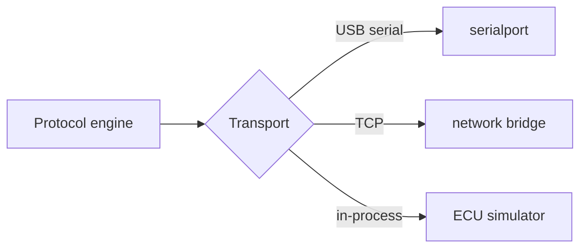

# ECU communication protocol

This document describes how OpenTune talks to an ECU. Like the rest of the system,
communication is **driven by the firmware INI** wherever possible: the INI declares
which commands and timeouts to use, so the same generic engine works across
Speeduino, rusEFI, and the MegaSquirt family.

It is an _implementer's reference_. Authoritative details live in the firmware
projects and their INIs; exact command bytes and quirks must be confirmed against
real firmware and covered by tests.

## Transport vs. protocol

OpenTune separates two concerns (see [ARCHITECTURE.md §5.1–5.2](ARCHITECTURE.md#5-backend-rust-modules)):

- **Transport** — moves raw bytes. Implementations: USB serial (primary) and the
  in-process **simulator**. TCP (Wi-Fi/serial bridges) and CAN are future candidates
  — not yet built (YAGNI until a real use case lands). The transport knows nothing
  about message meaning.
- **Protocol** — the conversation: handshake, reading/writing memory pages,
  burning to flash, and streaming real-time data. Parameterized by INI settings.



## The conversation model

Serial communication with these ECUs is a **single, ordered conversation**: one
request, one response, no interleaving. OpenTune therefore serializes all hardware
access through a single owner task (see
[ARCHITECTURE.md §9](ARCHITECTURE.md#9-concurrency--performance-model)).

### Typical operations

| Operation              | Purpose                                                   |
| ---------------------- | --------------------------------------------------------- |
| **Signature / query**  | Identify the firmware; match it to an INI.                |
| **Version info**       | Human-readable firmware version string.                   |
| **Read page**          | Read a region of configuration memory (a "page").         |
| **Write**              | Write bytes at a page offset — applies _live_ to ECU RAM. |
| **Burn**               | Persist the current RAM page(s) to non-volatile flash.    |
| **Get real-time data** | Fetch one frame of output channels (telemetry).           |
| **Command/action**     | Named actions (e.g., output tests) from the INI.          |

The specific command characters/bytes, page-select mechanism, timeouts, and
inter-command delays are taken from the INI's communication settings (e.g., query
command, output-channel get command, page read/write commands, burn command,
activation delays, block read timeouts). This is why a single implementation can
serve many ECUs.

## Memory pages

ECU configuration is organized into **pages** — contiguous regions read and written
as units and burned to flash as units. Depending on firmware:

- there may be a **page-select** step before access, or the page may be encoded in
  the command itself;
- page **sizes and counts** come from the INI `[Constants]` section;
- writes are typically **partial** (offset + length) for responsiveness, while
  reads are often whole-page.

The `model` crate maps named constants to `(page, offset, type)` and applies
scaling; the `protocol` crate moves the bytes.

## Framing, integrity, and endianness

- **CRC protocol:** newer firmware/protocol generations wrap commands and
  responses with a length prefix and a **CRC32** for integrity. OpenTune supports
  both the legacy (unframed) and CRC-framed styles, selected from the INI.
- **Endianness:** fields may be big- or little-endian; the model honors the
  per-field setting from the INI.
- **Timeouts & retries:** every hardware op has a timeout and bounded retry with
  backoff. A failed op must never leave the ECU half-written.

## Handshake & connect sequence

```mermaid
sequenceDiagram
    participant App as Protocol engine
    participant ECU
    App->>ECU: signature/query
    ECU-->>App: signature
    App->>App: match signature ↔ INI; abort/warn on mismatch
    App->>ECU: version query
    ECU-->>App: version string
    loop for each page
        App->>ECU: read page
        ECU-->>App: page bytes
    end
    App->>App: build Tune (pages + INI)
    App->>App: begin real-time polling
```

Signature matching is important: an INI that doesn't match the connected firmware
can misinterpret memory. OpenTune verifies the signature and warns/blocks on
mismatch rather than risk corrupting a tune.

## Real-time polling

After connecting, a dedicated loop requests output-channel frames at a configurable
rate, decodes them via the INI, and publishes:

- throttled/coalesced updates to the UI (events), and
- full-rate samples to the datalogger.

Acquisition rate is decoupled from UI refresh so the WebView is never the
bottleneck.

## Live tuning & burn semantics

- **Writes are live:** changing a constant writes to ECU **RAM** immediately, so
  the effect is felt at once (essential for tuning a running engine).
- **Burn persists:** an explicit **burn** copies RAM → flash. Until then, edits are
  "modified but not burned"; the UI must make this state obvious and offer
  verification.
- **Safety:** verified writes where supported, careful ordering around
  page-activation/burn, and never leaving a page partially written.

## Transports in detail

- **Serial (primary):** cross-platform via `serialport`; baud and port from user
  settings; VID/PID hints help identify likely ECUs during enumeration.
- **TCP (planned, not yet built):** for Wi-Fi/serial bridges and remote setups;
  same protocol over a socket. Out of scope until a real TCP-bridge use case lands.
- **Simulator:** an in-process transport+protocol that emulates a real INI for
  hardware-free development and CI (see
  [ARCHITECTURE.md §10](ARCHITECTURE.md#10-the-ecu-simulator)).
- **CAN (future):** some ECUs expose tuning/telemetry over CAN; the trait-based
  design leaves room for it.

## Implementer cautions

- ⚠️ **Confirm specifics against real firmware.** Command bytes, delays, page
  mechanics, and CRC details vary across firmwares and versions — drive them from
  the INI and verify with the simulator and real hardware.
- ⚠️ **One conversation at a time.** Never let two operations interleave on the
  wire.
- ⚠️ **Fail safe.** On timeout/error, abort cleanly; surface the error; keep the
  ECU and the in-memory tune consistent.
